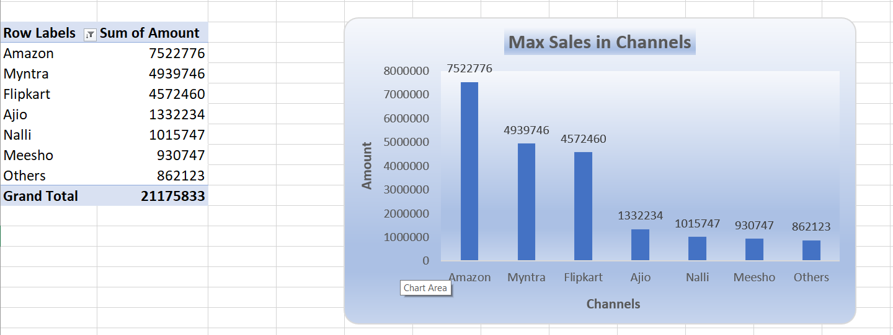
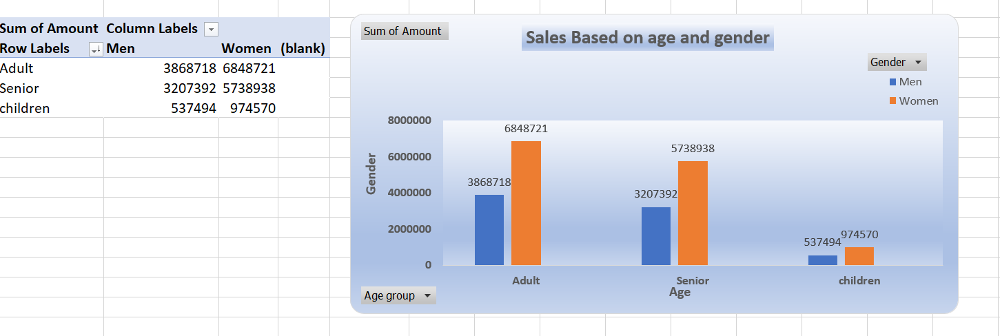
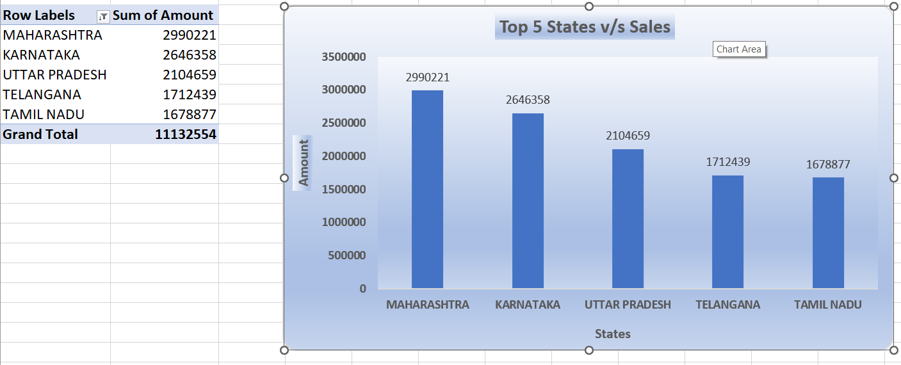

# 📊 Sales Analysis Dashboard (Excel Project)

## Project Overview
This project analyzes **sales performance data** using Microsoft Excel.  
It includes KPIs like **total sales, profit, quantity sold, and regional performance**, visualized through an interactive Excel dashboard.

---

## 📸 Dashboard Preview

### Full Dashboard

### Maximum Sales in Sales

### Sales Based on Gender and Age

### Top States in Sales 

---

## 📥 Download Project File

- **Excel File** → [Click to Download](https://github(https://github.com/Sanjayr1904/Sales_Analysis_Excel_Project/blob/main/Sales_Analysis.xlsx)

---

## 🔗 Connect with Me
👨‍💻 **Sanjay R**  
- [GitHub](https://github.com/Sanjayr1904)  
- [LinkedIn](https://www.linkedin.com/in/sanjay-190401-r)
